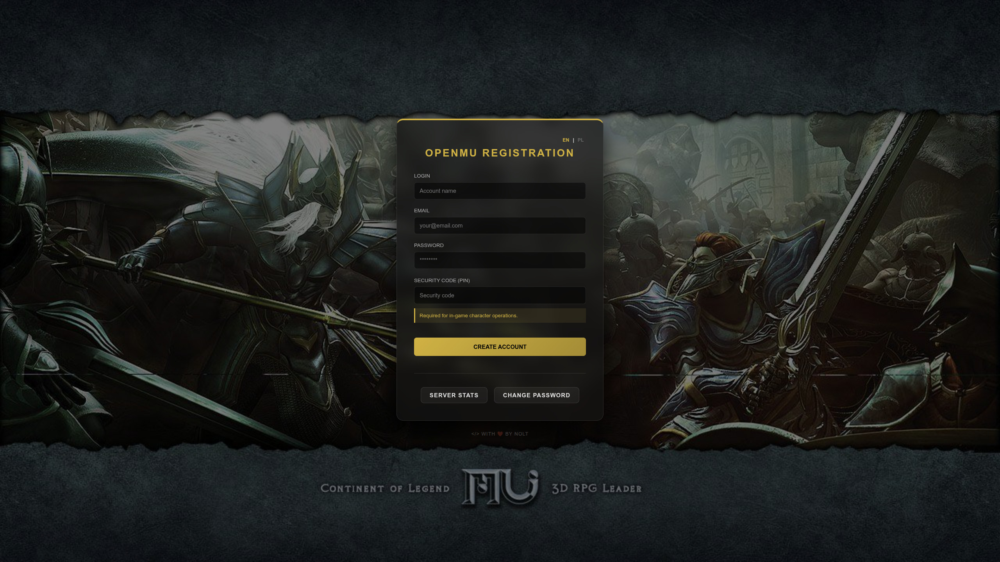
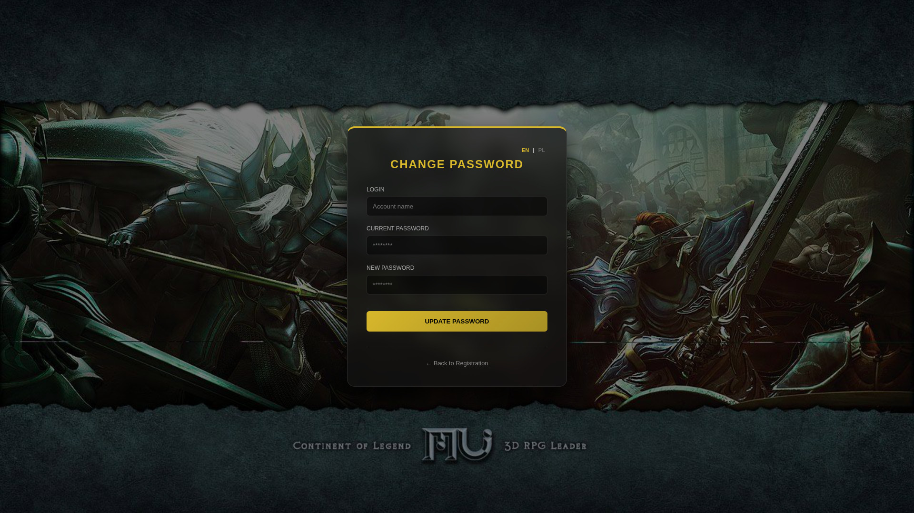

# openmu-simple-web
This is simple website for OpenMU. 

It was created as website for mine OpenMU builder: https://github.com/nolt/openmu-docker

Website allows:
- register new account
- change password

Future plans:
- list characters with all details (resets, stats)

## Requirements
- Docker
- Docker Compose

## Building
- clone this repository
- replace values in .env to your own
- build
---
Build your service:

```docker compose up -d --build```

Images:





---


More info about OpenMU project you will find here:
https://github.com/MUnique/OpenMU

