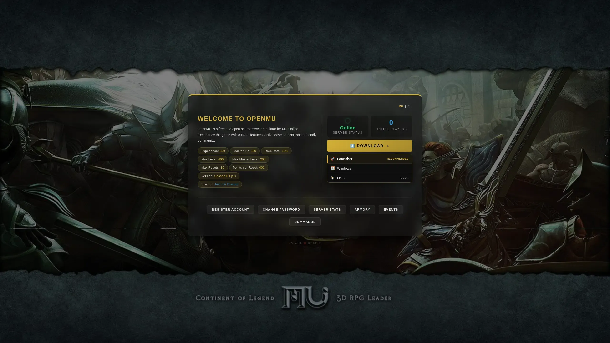

# openmu-simple-web
This is simple website for OpenMU. 

Website has been created for mine OpenMU server builder: https://github.com/nolt/openmu-docker  
It connects to same docker network where database is.

Website is multilanguage English and Polish.

## Website allows:
- register new account
- change password
- server status
- server TOP 10
- event status info (BC/DS/CC etc.)
- armory (character equipment viewer)
- chat commands reference

## Requirements
- Docker
- Docker Compose

## Building
- clone this repository
- replace values in .env to your own
- build

Build your service:

```docker compose up -d --build```

## Adding a new language

The pages share a single Razor layout (`Pages/Shared/_Layout.cshtml`), so adding a language
means editing **one config list** — no per-page changes.

1. **Create a translation file**
   - Copy `wwwroot/template_lang.js` (an empty skeleton with every key) — or the
     already-translated `wwwroot/en.js` — to your language code, e.g. `de.js` for German.
   - Change the object key on line 2 (`window.muTranslations.xx`) to your code, e.g. `.de`.
   - Fill in every value with your translation.

2. **Register it in the site config**
   Add the code to the `Site:Languages` array in `appsettings.json` — the single place the
   language list lives. The shared layout emits the `<script>` tag for every listed language
   on every page automatically:
   ```json
   "Site": {
     "Languages": [ "en", "pl", "de" ],
     "DefaultLanguage": "en"
   }
   ```

3. **Update content.js (optional)**
   The homepage rates and welcome text come from `window.muContent` in `wwwroot/content.js`.
   Add your language section there, following the same pattern as `en` and `pl`.

4. **Done**
   `lang.js` builds the switch buttons automatically from every language found in
   `window.muTranslations` — no per-page button editing. The button label is the uppercased
   code (e.g. `DE`); for a nicer label add an entry to the `LABELS` map in `wwwroot/lang.js`.

To start the site in another language by default, set `Site:DefaultLanguage` (e.g. `"de"`) in
`appsettings.json`. That single value is handed to `lang.js`; no page edits.

## Setting the download links

The home page download menu is driven by `window.muConfig.downloads` in `wwwroot/content.js`.
Each entry is one target:

```js
downloads: [
    { id: "launcher", icon: "🚀", name: "Launcher", url: "https://...", recommended: true },
    { id: "windows",  icon: "🪟", name: "Windows",  url: "https://..." },
    { id: "linux",    icon: "🐧", name: "Linux",    url: "#", soon: true },
],
```

- `url` — the download link. **The shipped values are `#` placeholders — set your own.**
- `recommended` — highlights the entry (e.g. the auto-updating launcher).
- `soon` — shows it as an upcoming, non-clickable target.

Add or remove a platform by editing this list — no markup changes. The generic labels
(Download / recommended / soon) come from the `dl*` keys in the language files.

---
Example:

---
More info about OpenMU project you will find here:
https://github.com/MUnique/OpenMU

