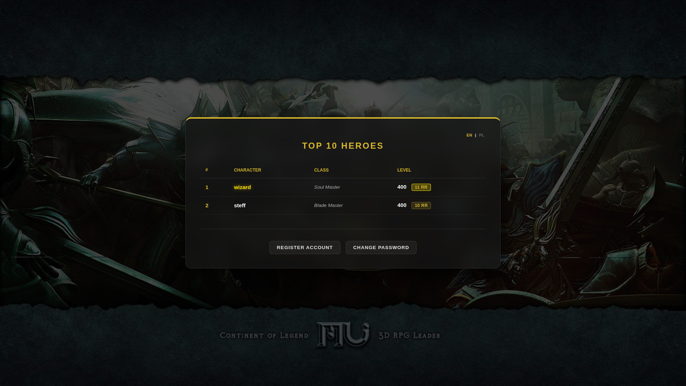

# openmu-simple-web
This is simple website for OpenMU. 

Website has been created for mine OpenMU server builder: https://github.com/nolt/openmu-docker  
It connects to same docker network where database is.

Website is multilanguage English and Polish.

Website allows:
- register new account
- change password
- server status
- server TOP 10

## Requirements
- Docker
- Docker Compose

## Building
- clone this repository
- replace values in .env to your own
- build
---
Build your service:

```docker compose up -d --build```

Images:




---


More info about OpenMU project you will find here:
https://github.com/MUnique/OpenMU

