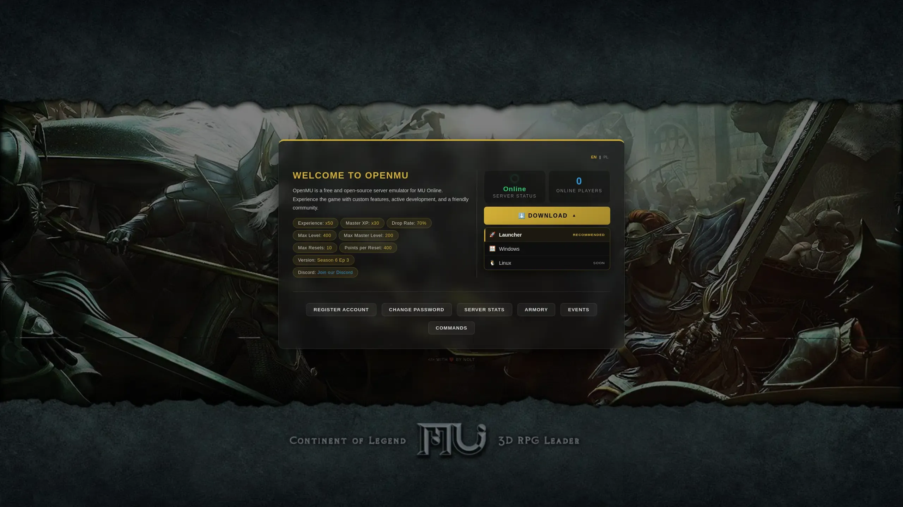

# openmu-simple-web

🇬🇧 [English version](README.md)

Prosta strona internetowa dla serwera OpenMU.

Strona powstała dla mojego zestawu do budowania serwera OpenMU: https://github.com/nolt/openmu-docker  
Łączy się z tą samą siecią Dockera, w której działa baza danych.

Strona jest wielojęzyczna: angielski i polski.

## Co oferuje strona:
- rejestracja nowego konta
- zmiana hasła
- status serwera
- ranking TOP 10
- informacje o eventach (BC/DS/CC itd.)
- armory (podgląd ekwipunku postaci)
- lista komend czatu

## Wymagania
- Docker
- Docker Compose

## Budowanie
- sklonuj to repozytorium
- podmień wartości w `.env` na własne
- zbuduj

Zbuduj usługę:

```docker compose up -d --build```

## Licznik graczy online (klucz API OpenMU)

Licznik graczy online czyta `/api/status` z panelu administracyjnego OpenMU (port 8080).
OpenMU chroni swoje API kluczami: gdy tylko powstanie pierwsze konto administratora, zapytania
bez klucza dostają `401` i licznik znika.

1. W panelu administracyjnym otwórz **API keys**, utwórz klucz (np. `website`) z rolą **Viewer**
   i skopiuj go — jest pokazywany tylko raz.
2. Wpisz go do `.env` jako `SERVER_CHECK_API_KEY=...` i zrestartuj stronę.

Klucz jest wysyłany po stronie serwera w nagłówku `X-Api-Key`; nigdy nie trafia do przeglądarki.
Zrób to przed utworzeniem pierwszego administratora, żeby licznik nie znikał.

## Dodawanie nowego języka

Wszystkie podstrony korzystają z jednego układu Razor (`Pages/Shared/_Layout.cshtml`), więc dodanie
języka oznacza edycję **jednej listy w konfiguracji** — bez zmian w poszczególnych podstronach.

1. **Utwórz plik tłumaczenia**
   - Skopiuj `wwwroot/template_lang.js` (pusty szkielet ze wszystkimi kluczami) — albo już
     przetłumaczony `wwwroot/en.js` — pod nazwą z kodem swojego języka, np. `de.js` dla niemieckiego.
   - Zmień klucz obiektu w linii 2 (`window.muTranslations.xx`) na swój kod, np. `.de`.
   - Uzupełnij każdą wartość swoim tłumaczeniem.

2. **Zarejestruj go w konfiguracji strony**
   Dodaj kod do tablicy `Site:Languages` w `appsettings.json` — to jedyne miejsce, w którym
   trzymana jest lista języków. Wspólny układ automatycznie wstawia znacznik `<script>` dla
   każdego języka z listy na każdej podstronie:
   ```json
   "Site": {
     "Languages": [ "en", "pl", "de" ],
     "DefaultLanguage": "en"
   }
   ```

3. **Uzupełnij content.js (opcjonalnie)**
   Stawki i tekst powitalny na stronie głównej pochodzą z `window.muContent` w `wwwroot/content.js`.
   Dodaj tam sekcję swojego języka, według tego samego wzoru co `en` i `pl`.

4. **Gotowe**
   `lang.js` sam buduje przyciski przełączania z każdego języka znalezionego w
   `window.muTranslations` — bez ręcznej edycji przycisków na podstronach. Etykietą przycisku jest
   kod wielkimi literami (np. `DE`); ładniejszą etykietę ustawisz, dodając wpis do mapy `LABELS`
   w `wwwroot/lang.js`.

Żeby strona domyślnie startowała w innym języku, ustaw `Site:DefaultLanguage` (np. `"de"`) w
`appsettings.json`. Ta jedna wartość jest przekazywana do `lang.js`; podstron nie trzeba edytować.

## Ustawianie linków do pobrania

Menu pobierania na stronie głównej jest sterowane przez `window.muConfig.downloads` w
`wwwroot/content.js`. Każdy wpis to jedna pozycja:

```js
downloads: [
    { id: "launcher", icon: "🚀", name: "Launcher", url: "https://...", recommended: true },
    { id: "windows",  icon: "🪟", name: "Windows",  url: "https://..." },
    { id: "linux",    icon: "🐧", name: "Linux",    url: "#", soon: true },
],
```

- `url` — link do pobrania. **Dostarczone wartości to zaślepki `#` — ustaw własne.**
- `recommended` — wyróżnia pozycję (np. launcher z automatyczną aktualizacją).
- `soon` — pokazuje ją jako zapowiedź, bez możliwości kliknięcia.

Platformę dodajesz lub usuwasz, edytując tę listę — bez zmian w kodzie strony. Ogólne etykiety
(Pobierz / zalecane / wkrótce) pochodzą z kluczy `dl*` w plikach językowych.

---
Przykład:

---
Więcej informacji o projekcie OpenMU:
https://github.com/MUnique/OpenMU

## Licencja
[MIT](LICENSE)

Autor oryginalny: [Nolt](https://github.com/nolt).
